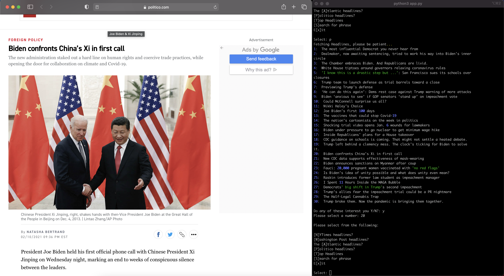

# NewsHeader

(Work in Progress)

* A simple program to quickly search news headlines from the comfort of your terminal

* If a headline interests you, you can select it and it will open in your browser for further consumption



# Why?

Just because

# Install

```bash
# Download Python >= 3.7
git clone https://github.com/GobiasSomeCoffeeCo/news_header.git
```
```bash
pip install -r requirements.txt
```